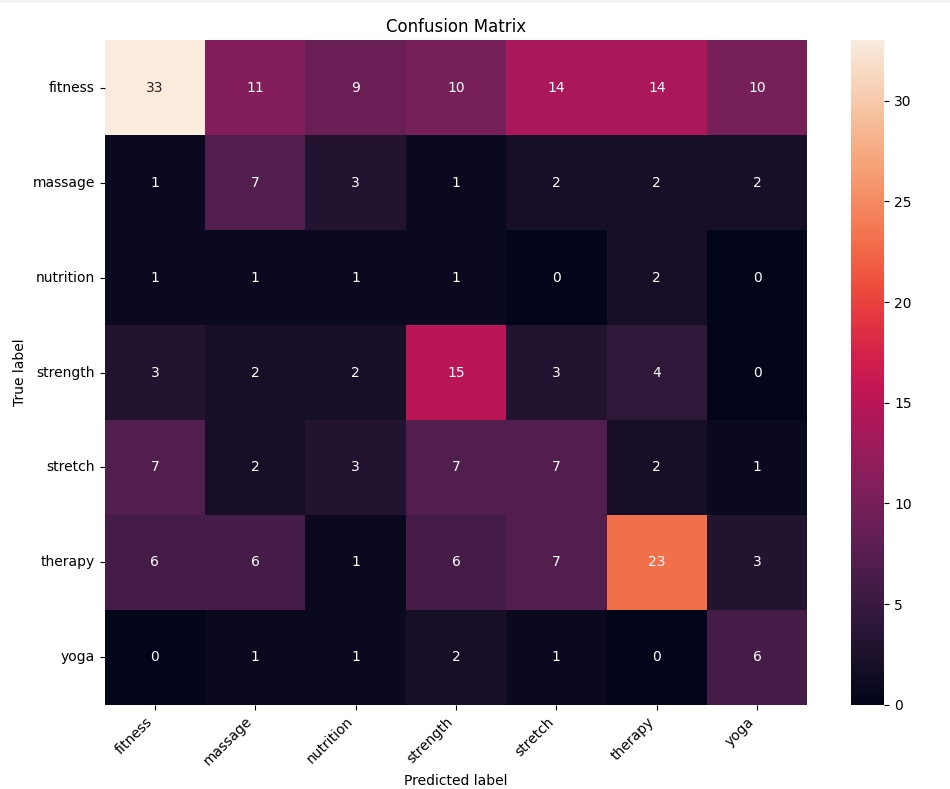

# Отчет по лабораторной работе №2

## ПОСТАНОВКА ЗАДАЧИ, ЦЕЛЬ РАБОТЫ

Цель работы:  
Научиться реализовывать полный pipeline классификации видео на практике с использованием датасета HowTo100M, предобученной модели VideoMAE для извлечения признаков и алгоритма Logistic Regression для итоговой классификации.

В рамках лабораторной работы решалась задача классификации видеороликов, связанных с health-like тематикой. Исходным источником данных выступал датасет HowTo100M. Так как полный HowTo100M является слишком большим для локальной обработки и содержит большое количество недоступных YouTube-ссылок, была сформирована ограниченная тематическая подвыборка видео.

Постановка задач:

1. Загрузить metadata датасета HowTo100M.
2. Сформировать health-like подвыборку по ключевым словам из metadata.
3. Скачать доступные видеоролики по YouTube ID с помощью `yt-dlp`.
4. Выполнить предобработку видео: извлечь кадры, изменить размер кадров и подготовить их для модели.
5. Использовать предобученную модель VideoMAE как feature extractor.
6. Получить embedding-векторы видеороликов размерности 768.
7. Обучить классификатор Logistic Regression поверх извлечённых признаков.
8. Оценить качество модели с помощью метрик Accuracy, Precision, Recall, F1-score и Top-K accuracy.
9. Провести анализ ошибок: построить confusion matrix и оценить ошибки по классам.
10. Сохранить обученную модель и дополнительные артефакты.

## ТЕОРЕТИЧЕСКАЯ БАЗА

### Датасет HowTo100M

HowTo100M — это крупный видеодатасет обучающих YouTube-видео. Он используется в задачах video understanding, video classification и обучения совместных видео-текстовых представлений.

В данной работе полный датасет не использовался, так как он слишком большой для локальной обработки. Вместо этого была использована metadata HowTo100M, по которой выбирались подходящие видеоролики, а затем доступные видео скачивались по YouTube ID.

Для отбора health-like видео использовались ключевые слова:

- `exercise`
- `workout`
- `fitness`
- `gym`
- `yoga`
- `pilates`
- `cardio`
- `massage`
- `meditation`
- `stretch`
- `stretching`
- `warm up`
- `warm-up`
- `therapy`
- `rehab`
- `health`
- `body`
- `muscle`
- `strength`
- `weight loss`
- `abs`
- `back pain`
- `physical therapy`
- `running`
- `nutrition`
- `diet`

После фильтрации видеоролики были распределены по следующим health-like категориям:

- `fitness`
- `massage`
- `nutrition`
- `strength`
- `stretch`
- `therapy`
- `yoga`

Изначально также рассматривались классы `cardio`, `rehab`, `pilates` и `meditation`, однако после загрузки видео часть этих классов оказалась слишком малочисленной. Поэтому для обучения использовались только классы, содержащие достаточное количество примеров.

### Предобработка видео

Видео не подавалось в модель напрямую. Сначала из каждого видеоролика извлекались отдельные кадры. Для этого использовалась библиотека OpenCV.

Основные этапы предобработки:

1. Открытие видеофайла с помощью OpenCV.
2. Получение количества кадров в видео.
3. Выбор 16 кадров, равномерно распределённых по ролику.
4. Преобразование цветового формата из BGR в RGB.
5. Изменение размера кадров.
6. Формирование списка кадров для подачи в VideoMAE.

Такой подход позволяет представить видео как последовательность изображений, которую может обработать видеомодель.

### Архитектура VideoMAE

VideoMAE — это модель для обработки видео, основанная на архитектуре Vision Transformer и masked autoencoding. Она анализирует не только отдельные кадры, но и временную структуру видео.

В данной лабораторной работе VideoMAE использовалась как feature extractor. Это означает, что модель не обучалась заново и не дообучалась на выбранной подвыборке. Она применялась для преобразования каждого видео в числовой embedding-вектор.

Каждый видеоролик после обработки VideoMAE представлялся вектором размерности 768. Эти признаки затем использовались для обучения классификатора.

### Классификатор Logistic Regression

Logistic Regression — это алгоритм машинного обучения для классификации. Несмотря на слово “regression” в названии, в данной работе он использовался именно для выбора класса видео.

Входом для Logistic Regression были не пиксели и не кадры напрямую, а embedding-векторы, извлечённые моделью VideoMAE. Поэтому классификатор обучался уже на готовых информативных признаках.

### Top-K Accuracy

Top-K accuracy — это метрика, которая проверяет, находится ли правильный класс среди K наиболее вероятных предсказаний модели.

Обычная Accuracy учитывает только самый вероятный класс. Если правильный класс оказался на втором или третьем месте, обычная Accuracy считает это ошибкой. Top-K accuracy позволяет оценить, насколько часто правильный ответ находится среди нескольких наиболее вероятных вариантов.

В работе использовались:

- `Top-2 Accuracy`
- `Top-3 Accuracy`

## РЕЗУЛЬТАТЫ РАБОТЫ И ТЕСТИРОВАНИЯ СИСТЕМЫ

В ходе работы был реализован следующий pipeline:

1. Загрузка metadata HowTo100M.
2. Формирование health-like подвыборки.
3. Загрузка доступных YouTube-видео через `yt-dlp`.
4. Извлечение кадров из видеороликов.
5. Получение признаков с помощью VideoMAE.
6. Обучение Logistic Regression.
7. Оценка качества модели.
8. Анализ ошибок модели.

В новой версии работы была увеличена выборка: вместо 100 видео было скачано 1000 доступных health-like видеороликов.

Итоговые результаты загрузки видео:

| Показатель | Значение |
|---|---:|
| Start metadata row | 0 |
| Rows scanned after start | 101715 |
| Health candidates | 2106 |
| Submitted download attempts | 2106 |
| Failed download attempts | 1786 |
| Successfully downloaded videos | 1000 |

Распределение скачанных видео по классам:

| Класс | Количество видео |
|---|---:|
| fitness | 407 |
| strength | 120 |
| stretch | 120 |
| massage | 72 |
| yoga | 42 |
| nutrition | 26 |
| rehab | 2 |
| cardio | 1 |
| pilates | 0 |
| meditation | 0 |
| **Итого** | **1000** |

Так как некоторые классы содержали слишком мало примеров, перед обучением были исключены редкие классы. В итоговое обучение вошли следующие классы:

- `fitness`
- `massage`
- `nutrition`
- `strength`
- `stretch`
- `therapy`
- `yoga`

После фильтрации использовался 981 видеоролик. Из них 735 видео вошли в обучающую выборку, а 246 видео — в валидационную выборку.

### Общие метрики

Результаты оценки модели:

| Метрика | Значение |
|---|---:|
| Accuracy | 0.3740 |
| Precision | 0.4660 |
| Recall | 0.3740 |
| F1-score | 0.3920 |
| Top-2 Accuracy | 0.5407 |
| Top-3 Accuracy | 0.6992 |

Accuracy составила 0.3740. Это означает, что модель правильно классифицировала около 37.4% видеороликов из валидационной выборки.

Top-2 Accuracy составила 0.5407. Это показывает, что правильный класс находился среди двух наиболее вероятных предсказаний примерно в 54.1% случаев.

Top-3 Accuracy составила 0.6992. Это означает, что почти в 70% случаев правильный класс попадал в три наиболее вероятных варианта модели.

### Метрики по классам

| Класс | Precision | Recall | F1-score | Support |
|---|---:|---:|---:|---:|
| fitness | 0.65 | 0.33 | 0.43 | 101 |
| massage | 0.23 | 0.39 | 0.29 | 18 |
| nutrition | 0.05 | 0.17 | 0.08 | 6 |
| strength | 0.36 | 0.52 | 0.42 | 29 |
| stretch | 0.21 | 0.24 | 0.22 | 29 |
| therapy | 0.49 | 0.44 | 0.46 | 52 |
| yoga | 0.27 | 0.55 | 0.36 | 11 |

Лучшее значение F1-score было получено для класса `therapy`:

```text
F1-score = 0.46
```

Также сравнительно хорошие результаты были получены для классов `fitness` и `strength`, где F1-score составил 0.43 и 0.42 соответственно.

Класс `fitness` имеет Precision = 0.65, но Recall = 0.33. Это означает, что если модель относит видео к классу `fitness`, она достаточно часто оказывается права, однако значительная часть настоящих fitness-видео распознаётся как другие классы.

Класс `yoga` имеет Recall = 0.55, но Precision = 0.27. Это означает, что модель находит больше половины yoga-видео, но при этом часто ошибочно относит к yoga видео других классов.

Самым сложным классом оказался `nutrition`, для которого F1-score составил 0.08. Это связано с малым количеством примеров: в валидационной выборке было всего 6 видео этого класса.

### Тестирование на валидационной выборке

Для тестирования использовалась валидационная выборка из 246 видеороликов. Confusion matrix была построена именно по этой выборке, а не по всем 1000 скачанным видео. Это нормально, так как часть данных использовалась для обучения, а часть — для проверки качества модели.

## АНАЛИЗ ОШИБОК

Для анализа ошибок использовались:

1. confusion matrix;
2. количество верных и неверных предсказаний;
3. анализ ошибок по каждому классу;
4. сравнение истинных и предсказанных меток.

### Общая статистика ошибок

На валидационной выборке было 246 видеороликов:

```text
Number of validation samples: 246
Number of wrong predictions: 154
Number of correct predictions: 92
```

Таким образом, модель правильно классифицировала 92 видео и ошиблась на 154 видео.

### Ошибки по классам

По confusion matrix можно определить количество верных и ошибочных предсказаний для каждого класса:

| Класс | Всего | Верно | Ошибочно | Error rate |
|---|---:|---:|---:|---:|
| fitness | 101 | 33 | 68 | 0.6733 |
| massage | 18 | 7 | 11 | 0.6111 |
| nutrition | 6 | 1 | 5 | 0.8333 |
| strength | 29 | 15 | 14 | 0.4828 |
| stretch | 29 | 7 | 22 | 0.7586 |
| therapy | 52 | 23 | 29 | 0.5577 |
| yoga | 11 | 6 | 5 | 0.4545 |

Наименьшая доля ошибок была у класса `yoga`:

```text
error_rate = 0.4545
```

Также сравнительно лучше модель справилась с классами `strength` и `therapy`.

Наибольшая доля ошибок была у класса `nutrition`:

```text
error_rate = 0.8333
```

Это связано с тем, что класс `nutrition` содержит мало примеров, а его визуальные признаки могут сильно отличаться от спортивных и физических категорий.

### Анализ confusion matrix



Confusion matrix использовалась для визуального анализа того, какие классы модель путает между собой.

Основные направления ошибок:

1. `fitness` → `stretch`
2. `fitness` → `therapy`
3. `fitness` → `massage`
4. `fitness` → `strength`
5. `stretch` → `fitness`
6. `stretch` → `strength`
7. `therapy` → `stretch`
8. `therapy` → `fitness`
9. `nutrition` → `therapy`
10. `yoga` → `strength`

Из матрицы видно, что модель часто путает классы, связанные с физическими действиями человека. Например, `fitness`, `strength`, `stretch` и `therapy` могут визуально содержать похожие сцены: упражнения, растяжку, движения с собственным весом, работу с телом или восстановительные действия.

Класс `fitness` оказался самым многочисленным в валидационной выборке: 101 видео. Из них 33 были классифицированы правильно, а остальные были распределены между классами `massage`, `nutrition`, `strength`, `stretch`, `therapy` и `yoga`.

Класс `therapy` также часто путался с другими категориями, особенно со `stretch`, `fitness`, `massage` и `strength`. Это объясняется тем, что терапевтические видео могут включать упражнения, растяжку, восстановление и элементы физической активности.

Класс `nutrition` оказался самым сложным для модели. Валидационная выборка содержала только 6 видео этого класса, поэтому модель не смогла устойчиво выделить его признаки.

## АНАЛИЗ РЕЗУЛЬТАТОВ

Полученное значение Accuracy = 0.3740 ниже, чем в предыдущей версии работы, где использовалась меньшая выборка. Однако новая версия является более сложной: вместо небольшой подвыборки из 100 видео использовалась расширенная выборка из 1000 скачанных видео, а после фильтрации модель обучалась на 7 классах.

Снижение Accuracy объясняется несколькими причинами:

1. Увеличилось количество классов.
2. Датасет получился несбалансированным.
3. Некоторые классы содержали мало примеров.
4. Health-like категории визуально похожи между собой.
5. Разметка была получена автоматически из metadata HowTo100M, а не вручную.

Несмотря на невысокую Accuracy, Top-3 Accuracy составила 0.6992. Это означает, что почти в 70% случаев правильный класс находился среди трёх наиболее вероятных предсказаний модели.

Top-2 Accuracy составила 0.5407. Это показывает, что в части ошибочных случаев правильный класс находился не на первом, но на втором месте среди вариантов модели.

Лучше всего модель показала себя на классах `therapy`, `fitness` и `strength`. Это связано с тем, что данные классы имеют более выраженные визуальные признаки и большее количество примеров по сравнению с малочисленными классами.

Наиболее сложным классом оказался `nutrition`. Для него F1-score составил 0.08. Причина заключается в малом числе примеров, а также в том, что nutrition-видео могут содержать сцены, визуально отличающиеся от упражнений, растяжки или физической активности.

В целом результаты показывают, что VideoMAE действительно извлекает полезные признаки из видео, однако итоговое качество классификации сильно зависит от баланса классов и качества разметки.

## ВЫВОДЫ ПО РАБОТЕ

В ходе выполнения лабораторной работы были решены все поставленные задачи:

1. Была загружена metadata датасета HowTo100M.
2. Была сформирована расширенная health-like подвыборка видеороликов.
3. Были скачаны 1000 доступных видео по YouTube ID с помощью `yt-dlp`.
4. Из каждого видео были извлечены кадры.
5. Предобученная модель VideoMAE была использована для получения embedding-векторов.
6. Поверх признаков VideoMAE был обучен классификатор Logistic Regression.
7. Качество модели было оценено с помощью Accuracy, Precision, Recall, F1-score и Top-K accuracy.
8. Был выполнен анализ ошибок с использованием confusion matrix.

Основные выводы:

1. Использование предобученной VideoMAE позволяет строить pipeline классификации видео без дообучения самой видеомодели.
2. Logistic Regression показала работоспособность при классификации embedding-векторов, полученных из видео.
3. Была успешно собрана расширенная выборка из 1000 health-like видеороликов.
4. После фильтрации редких классов в обучении использовался 981 видеоролик.
5. Модель обучалась на 735 видео и тестировалась на 246 видео.
6. Итоговая Accuracy на валидационной выборке составила 0.3740.
7. Top-2 Accuracy составила 0.5407.
8. Top-3 Accuracy составила 0.6992.
9. Лучшие результаты по F1-score были получены для классов `therapy`, `fitness` и `strength`.
10. Наиболее сложным классом оказался `nutrition`, что связано с малым количеством примеров.
11. Основные ошибки связаны с визуальной похожестью категорий `fitness`, `strength`, `stretch` и `therapy`.
12. Для повышения качества модели необходимо улучшить баланс классов, увеличить количество примеров в слабых категориях и по возможности использовать более точную ручную разметку.

Цель работы достигнута: был реализован полный pipeline классификации health-like видео на основе HowTo100M, VideoMAE и Logistic Regression.

## ИСПОЛЬЗОВАННЫЕ ИСТОЧНИКИ

1. https://huggingface.co/docs/transformers/model_doc/videomae
2. https://huggingface.co/datasets/HuggingFaceM4/howto100m
3. https://github.com/yt-dlp/yt-dlp
4. https://scikit-learn.org/stable/modules/generated/sklearn.linear_model.LogisticRegression.html
5. https://scikit-learn.org/stable/modules/generated/sklearn.metrics.top_k_accuracy_score.html
6. https://docs.opencv.org/4.x/
7. https://pytorch.org/
