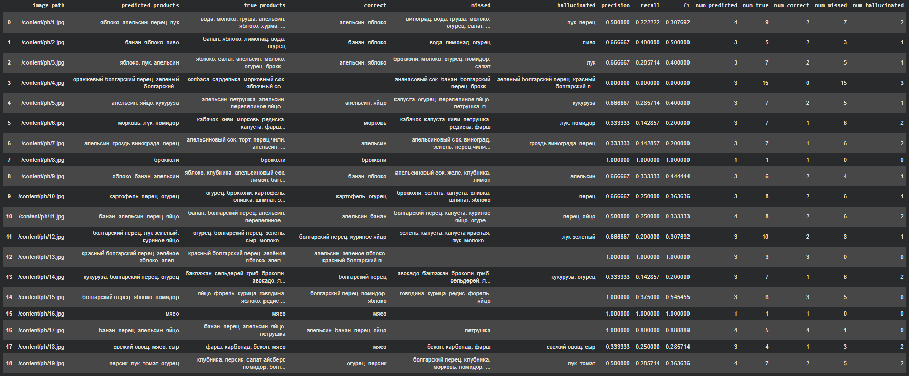
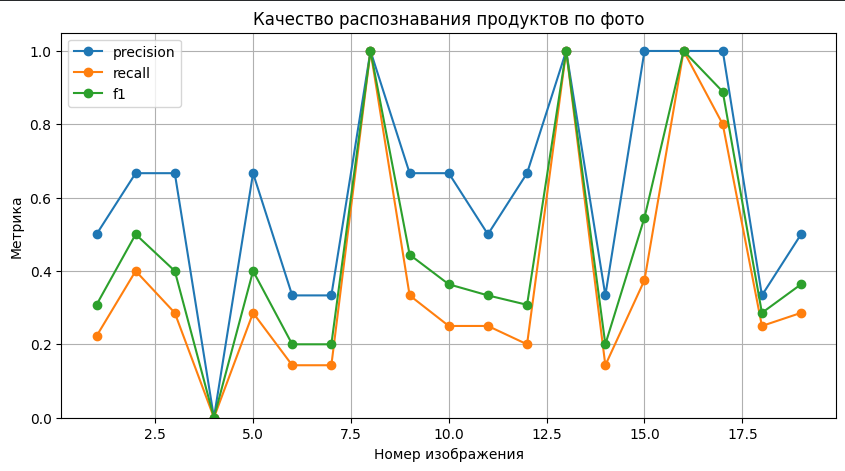

# Отчет по лабораторной работе №3

## ПОСТАНОВКА ЗАДАЧИ, ЦЕЛЬ РАБОТЫ

Цель работы:  
Научиться реализовывать практический pipeline мультимодальной системы, которая по фотографии холодильника или продуктовой полки распознает продукты питания, а затем на основе найденных ингредиентов генерирует 2-3 рецепта.

В рамках лабораторной работы решалась задача применения мультимодальной модели для анализа изображений и языковой модели для генерации текстового ответа. На вход системе подается фотография с продуктами, после чего модель компьютерного зрения и языка определяет видимые продукты, а отдельная языковая модель составляет рецепты с учетом распознанного списка ингредиентов и пользовательских ограничений.

Постановка задач:

1. Подготовить среду выполнения Google Colab с поддержкой GPU.
2. Установить необходимые зависимости: `transformers`, `accelerate`, `qwen-vl-utils`, `pandas`, `Pillow`, `matplotlib`, `openpyxl`.
3. Загрузить изображения холодильника или продуктовой полки из папки `/content/ph`.
4. Использовать мультимодальную модель `Qwen/Qwen2.5-VL-3B-Instruct` для распознавания продуктов на изображениях.
5. Получить структурированный список продуктов в формате JSON с указанием названия, категории и уверенности модели.
6. Очистить и обработать ответы модели, удалить дубликаты и сформировать таблицу распознанных продуктов.
7. Освободить память GPU после работы VLM и загрузить языковую модель `Qwen/Qwen2.5-1.5B-Instruct`.
8. Сгенерировать 2-3 рецепта на русском языке по найденным продуктам с учетом пользовательских предпочтений.
9. Подготовить файл для ручной проверки качества распознавания продуктов.
10. После ручной разметки рассчитать метрики Precision, Recall и F1-score.
11. Провести анализ ошибок: определить пропущенные продукты и лишние предсказания модели.
12. Сохранить результаты работы в файлы `recipes_result.md`, `eval_template.xlsx` и `eval_results.csv`.

## ТЕОРЕТИЧЕСКАЯ БАЗА

### Мультимодальные модели

Мультимодальные модели — это модели искусственного интеллекта, которые могут работать сразу с несколькими типами данных, например с изображениями и текстом. В данной лабораторной работе мультимодальная модель применяется для анализа фотографии и формирования текстового описания найденных продуктов.

В отличие от обычной языковой модели, которая получает только текст, VLM-модель получает изображение и текстовую инструкцию. В результате она может распознать объекты на изображении и вернуть ответ в заданном формате.

В данной работе используется модель:

```text
Qwen/Qwen2.5-VL-3B-Instruct
```

Она применяется для распознавания продуктов питания на фотографиях холодильника или продуктовой полки.

### Распознавание продуктов по изображению

Основная задача первого этапа — найти только те продукты, которые реально видны на фотографии. Для этого используется специальный prompt, в котором модели явно указывается:

1. анализировать фото холодильника или продуктовой полки;
2. находить только реально видимые продукты питания;
3. не выдумывать продукты;
4. для плохо видимых продуктов указывать низкую уверенность;
5. возвращать результат только в формате JSON.

Ожидаемый формат ответа модели:

```json
[
  {
    "name": "название продукта на русском",
    "category": "овощи / фрукты / молочные / мясо / рыба / напитки / крупы / соусы / другое",
    "confidence": 0.0
  }
]
```

Такой формат удобен для дальнейшей автоматической обработки, так как каждый продукт имеет название, категорию и численную оценку уверенности.

### Обработка ответа модели

Ответы генеративных моделей не всегда строго соответствуют заданному формату. Поэтому в коде реализована дополнительная обработка вывода VLM.

Используются следующие функции:

1. `clean_model_output()` — удаляет markdown-разметку и лишние символы.
2. `extract_complete_json_objects()` — извлекает полные JSON-объекты из ответа модели.
3. `parse_product_object()` — пытается преобразовать найденный объект в Python-словарь.
4. `extract_products_from_raw_output()` — формирует итоговый список продуктов и удаляет дубликаты.
5. `get_ingredient_names()` — извлекает только названия продуктов с учетом минимального допустимого значения уверенности.

Такая обработка делает pipeline более устойчивым к некорректным или частично поврежденным ответам модели.

### Генерация рецептов

После распознавания продуктов используется отдельная языковая модель:

```text
Qwen/Qwen2.5-1.5B-Instruct
```

Она получает список ингредиентов и пользовательские пожелания. В текущем коде примером ограничения является:

```text
без мяса
```

Языковая модель должна составить 2-3 практичных рецепта на русском языке. В prompt указаны ограничения:

1. использовать в основном продукты из распознанного списка;
2. разрешить только базовые добавки: воду, соль, перец, растительное масло и сухие специи;
3. не добавлять новые обязательные продукты, которых нет в списке;
4. дополнительные продукты помечать как опциональные;
5. для каждого рецепта указывать название, продукты, добавки, время и шаги приготовления.

Таким образом, LLM используется не как самостоятельный источник ингредиентов, а как генератор рецептов на основе результата, полученного от VLM.

### Ручная проверка качества

Так как автоматическая модель может пропускать продукты или добавлять лишние, в лабораторной работе предусмотрена ручная проверка результатов.

Для этого создается файл:

```text
/content/eval_template.xlsx
```

В нем содержатся:

- путь к изображению;
- предсказанные продукты;
- категории продуктов;
- количество найденных продуктов;
- пустое поле `true_products` для ручной разметки;
- поле `comment` для комментариев.

После заполнения истинного списка продуктов файл загружается обратно в Colab, и программа автоматически рассчитывает метрики качества.

### Метрики оценки

Для оценки качества распознавания продуктов используются Precision, Recall и F1-score.

Precision показывает, какая доля предсказанных моделью продуктов действительно присутствует на изображении. Чем выше Precision, тем меньше лишних выдуманных продуктов.

Recall показывает, какую долю реальных продуктов модель смогла найти. Чем выше Recall, тем меньше пропущенных продуктов.

F1-score объединяет Precision и Recall в одну метрику и показывает общий баланс между лишними и пропущенными предсказаниями.

В коде также отдельно считаются:

- `correct` — правильно найденные продукты;
- `missed` — продукты, которые были на фото, но модель их пропустила;
- `hallucinated` — продукты, которые модель предсказала, но которых не было на фото;
- `num_predicted` — количество предсказанных продуктов;
- `num_true` — количество реально присутствующих продуктов;
- `num_correct` — количество совпадений;
- `num_missed` — количество пропусков;
- `num_hallucinated` — количество лишних предсказаний.

## РЕЗУЛЬТАТЫ РАБОТЫ И ТЕСТИРОВАНИЯ СИСТЕМЫ

В ходе выполнения лабораторной работы был реализован полный pipeline мультимодальной системы:

1. поиск изображений в папке `/content/ph`;
2. предварительный просмотр первого изображения;
3. загрузка модели `Qwen/Qwen2.5-VL-3B-Instruct`;
4. распознавание продуктов на каждом изображении;
5. очистка и парсинг JSON-ответов модели;
6. формирование таблицы распознанных продуктов;
7. освобождение памяти GPU перед загрузкой языковой модели;
8. загрузка модели `Qwen/Qwen2.5-1.5B-Instruct`;
9. генерация рецептов по списку найденных продуктов;
10. сохранение рецептов в Markdown-файл;
11. создание Excel-файла для ручной разметки;
12. загрузка размеченного файла;
13. расчет метрик качества;
14. анализ пропущенных и лишних продуктов;
15. построение графика Precision, Recall и F1-score по изображениям.

### Распознавание продуктов

Для каждого изображения система вызывает функцию `detect_products()`. Она передает фотографию и инструкцию в VLM-модель, получает сырой текстовый ответ, извлекает из него JSON-объекты и формирует список найденных продуктов.

Результаты распознавания сохраняются в таблицу `pred_df`.

В таблице содержатся следующие поля:


| Поле                 | Описание                         |
| -------------------- | -------------------------------- |
| `index`              | номер изображения                |
| `image_path`         | путь к файлу изображения         |
| `predicted_products` | список найденных продуктов       |
| `uncertain`          | продукты с уверенностью ниже 0.6 |
| `categories`         | категории найденных продуктов    |
| `num_products`       | количество найденных продуктов   |
| `raw_output`         | фрагмент исходного ответа модели |


Такая таблица позволяет быстро проверить, какие продукты модель нашла на каждом фото и какие предсказания являются менее уверенными.

### Генерация рецептов

После завершения распознавания продуктов выбирается одно изображение по индексу:

```python
IMAGE_INDEX = 0
```

Из него извлекаются продукты с уверенностью не ниже 0.25. Затем языковая модель генерирует рецепты с учетом количества порций и пользовательских предпочтений.

В текущем коде используются параметры:

```python
SERVINGS = 2
PREFERENCES = "без мяса"
```

Результат сохраняется в файл:

```text
/content/recipes_result.md
```

Файл содержит:

1. заголовок;
2. путь к фотографии;
3. список распознанных продуктов;
4. сгенерированные рецепты.

### Файл для ручной проверки

Для оценки качества распознавания автоматически создается файл:

```text
/content/eval_template.xlsx
```

Пользователь должен вручную заполнить колонку `true_products`, указав реальные продукты на каждом изображении. Продукты разделяются точкой, так как в коде задан разделитель:

```python
PRODUCT_SEPARATOR = "."
```

После заполнения файл загружается обратно в Colab, и система рассчитывает метрики качества.

### Итоговые метрики

Численные значения метрик зависят от набора изображений в папке `/content/ph` и от ручной разметки файла `eval_template.xlsx`.

После загрузки размеченного файла программа автоматически выводит следующие итоговые показатели:


| Метрика              | Описание                                 |
| -------------------- | ---------------------------------------- |
| `num_images`         | количество проверенных изображений       |
| `mean_precision`     | средняя точность распознавания           |
| `mean_recall`        | средняя полнота распознавания            |
| `mean_f1`            | средний F1-score                         |
| `total_predicted`    | общее количество предсказанных продуктов |
| `total_true`         | общее количество реальных продуктов      |
| `total_correct`      | количество правильно найденных продуктов |
| `total_missed`       | количество пропущенных продуктов         |
| `total_hallucinated` | количество лишних предсказаний           |





Итоговые численные значения ручной разметки рассчитываются при запуске лабораторной работы после загрузки размеченного файла.

## АНАЛИЗ ОШИБОК

В работе предусмотрен анализ двух основных типов ошибок:

1. пропущенные продукты;
2. лишние предсказания модели.

Пропущенные продукты сохраняются в колонке:

```text
missed
```

Лишние предсказания сохраняются в колонке:

```text
hallucinated
```

Для подсчета частот используется `Counter`. Программа выводит до 20 наиболее частых пропусков и до 20 наиболее частых лишних предсказаний.

Такой анализ позволяет понять, какие продукты модель распознает хуже всего. Например, модель может пропускать мелкие объекты, продукты в упаковке, частично закрытые продукты или продукты с неочевидным внешним видом. Лишние предсказания могут появляться из-за похожих упаковок, нечеткого изображения или склонности генеративной модели дополнять список вероятными продуктами.

Топ пропущенных продуктов:
```text
огурец: 7
капуста: 5
помидор: 4
салат: 3
молоко: 3
брокколи: 3
болгарский перец: 3
петрушка: 3
томат: 3
зелень: 3
вода: 2
виноград: 2
перец чили: 2
сыр: 2
перепелиное яйцо: 2
фарш: 2
апельсиновый сок: 2
клубника: 2
яблоко: 2
хурма: 1
```

Топ придуманных продуктов:
```text
лук: 4
перец: 4
кукуруза: 2
пиво: 1
зеленый болгарский перец: 1
красный болгарский перец: 1
оранжевый болгарский перец: 1
помидор: 1
гроздь винограда: 1
апельсин: 1
яйцо: 1
лук зеленый: 1
огурец: 1
свежий овощ: 1
сыр: 1
томат: 1
```

### График метрик

После расчета метрик строится график по изображениям. На нем отображаются:

- Precision;
- Recall;
- F1-score.



График позволяет увидеть, на каких фотографиях модель работала хорошо, а на каких допустила много ошибок. Если на отдельном изображении Precision низкий, это означает большое количество лишних предсказаний. Если низкий Recall, значит модель пропустила много реальных продуктов.


### Возможные причины ошибок

Основные причины ошибок при распознавании продуктов:

1. продукт частично закрыт другими объектами;
2. упаковка продукта плохо видна;
3. изображение имеет низкое качество или слабое освещение;
4. несколько продуктов находятся слишком близко друг к другу;
5. модель путает похожие категории продуктов;
6. модель распознает не конкретный продукт, а общий тип упаковки;
7. генеративная модель может добавить вероятный продукт, которого на фото нет.

Для уменьшения количества ошибок можно использовать более качественные фотографии, увеличить разрешение изображений, уточнить prompt и вручную проверять продукты с низкой уверенностью.

## АНАЛИЗ РЕЗУЛЬТАТОВ

Реализованная система демонстрирует практический пример связки VLM и LLM. Первая модель отвечает за понимание изображения, а вторая — за генерацию текстового результата на основе распознанных данных.

Главное преимущество такого подхода заключается в разделении задач. VLM не должна составлять рецепты, а только извлекает факты из изображения. LLM, в свою очередь, не анализирует изображение напрямую, а работает с уже подготовленным списком продуктов. Это делает pipeline более понятным, управляемым и удобным для оценки.

Особое внимание в работе уделено снижению галлюцинаций. В prompt для VLM явно указано не выдумывать продукты, а в prompt для LLM указано не добавлять отсутствующие ингредиенты как обязательные. Кроме того, оценка качества отдельно учитывает `hallucinated` — продукты, которые были предсказаны моделью, но отсутствовали на изображении.

Важной частью работы является ручная разметка. Для задачи распознавания продуктов автоматическая оценка невозможна без эталонного списка ингредиентов. Поэтому программа создает шаблон `eval_template.xlsx`, который пользователь заполняет вручную. После этого система рассчитывает Precision, Recall и F1-score.

Полученный pipeline можно использовать как основу для более сложного приложения: например, кулинарного помощника, сервиса учета продуктов или системы рекомендаций рецептов по фото холодильника.

## ВЫВОДЫ ПО РАБОТЕ

В ходе выполнения лабораторной работы были решены все поставленные задачи:

1. Была подготовлена среда Google Colab и установлены необходимые зависимости.
2. Был реализован поиск изображений в заданной папке.
3. Была загружена модель `Qwen/Qwen2.5-VL-3B-Instruct`.
4. Был реализован механизм распознавания продуктов на фотографиях.
5. Ответы модели были приведены к структурированному виду и обработаны как JSON.
6. Была сформирована таблица распознанных продуктов.
7. После завершения работы VLM была очищена память GPU.
8. Была загружена языковая модель `Qwen/Qwen2.5-1.5B-Instruct`.
9. Была реализована генерация рецептов по найденным продуктам.
10. Был создан файл для ручной проверки качества распознавания.
11. Была реализована загрузка размеченного файла и автоматический расчет метрик.
12. Был выполнен анализ ошибок по пропущенным и лишним продуктам.
13. Был построен график Precision, Recall и F1-score по изображениям.

Основные выводы:

1. Мультимодальная модель позволяет извлекать список продуктов непосредственно из фотографии.
2. Языковая модель может использовать распознанные продукты для генерации практичных рецептов.
3. Разделение pipeline на VLM и LLM делает систему более управляемой и удобной для анализа.
4. Формат JSON упрощает обработку результатов, но требует дополнительной очистки, так как модель может возвращать ответ с ошибками форматирования.
5. Ручная разметка необходима для объективной оценки качества распознавания.
6. Precision показывает количество лишних продуктов, Recall — количество пропусков, а F1-score — общий баланс качества.
7. Наиболее важными ошибками для данной задачи являются пропуски реальных продуктов и галлюцинации, то есть добавление продуктов, которых нет на фото.
8. Для повышения качества системы можно увеличить количество тестовых изображений, улучшить качество фотографий, уточнить prompt и добавить проверку продуктов с низкой уверенностью.

Цель работы достигнута: был реализован pipeline мультимодальной системы, которая распознает продукты на фотографии, формирует список ингредиентов, генерирует рецепты и позволяет оценить качество распознавания с помощью ручной разметки и метрик Precision, Recall и F1-score.

## ИСПОЛЬЗОВАННЫЕ ИСТОЧНИКИ

1. [https://huggingface.co/Qwen/Qwen2.5-VL-3B-Instruct](https://huggingface.co/Qwen/Qwen2.5-VL-3B-Instruct)
2. [https://huggingface.co/Qwen/Qwen2.5-1.5B-Instruct](https://huggingface.co/Qwen/Qwen2.5-1.5B-Instruct)
3. [https://huggingface.co/docs/transformers/index](https://huggingface.co/docs/transformers/index)
4. [https://github.com/QwenLM/Qwen2.5-VL](https://github.com/QwenLM/Qwen2.5-VL)
5. [https://github.com/QwenLM/qwen-vl-utils](https://github.com/QwenLM/qwen-vl-utils)
6. [https://pytorch.org/](https://pytorch.org/)
7. [https://pandas.pydata.org/](https://pandas.pydata.org/)
8. [https://pillow.readthedocs.io/](https://pillow.readthedocs.io/)
9. [https://matplotlib.org/](https://matplotlib.org/)
10. [https://scikit-learn.org/stable/modules/model_evaluation.html](https://scikit-learn.org/stable/modules/model_evaluation.html)

